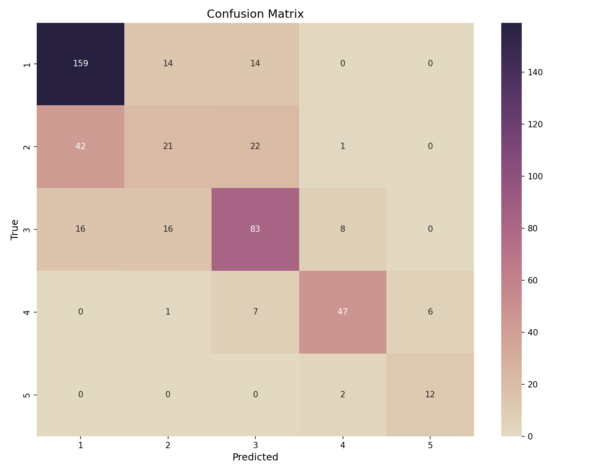

# Classification of KL grades of Knee Osteoarthritis
Deep Learning project focused in classifying different KL grades of Osteoarthritis in the knee region. 

## Results
Results were achieved using transfer learning on Resnet34.

### Validation
Using k-fold cross validation the following aggregated metrics were collected: (mean ± std)
```
Loss: 1.1495 ± 0.1744
Accuracy: 0.6628 ± 0.0200
Balanced Accuracy: 0.6628 ± 0.0200
Precision (macro): 0.6446 ± 0.0302
Recall (macro): 0.6628 ± 0.0200
F1 Score (macro): 0.6440 ± 0.0188
Cohen's Kappa: 0.4810 ± 0.0402
ROC-AUC (macro): 0.8584 ± 0.0161

Per-class F1: ['0.718', '0.304', '0.602', '0.760', '0.836'] ± ['0.061', '0.040', '0.020', '0.044', '0.045']
Per-class Precision: ['0.720', '0.335', '0.583', '0.814', '0.769'] ± ['0.036', '0.038', '0.044', '0.044', '0.135']
Per-class Recall: ['0.720', '0.304', '0.629', '0.714', '0.947'] ± ['0.094', '0.112', '0.058', '0.049', '0.072']
```
### Evaluation
Soft voting of k-fold ensemble was utilized for evaluation on the held-out test set. 
Metrics of ensemble evaluation:
```
  Loss: 0.8549
  Accuracy: 0.6794
  Balanced Accuracy: 0.6794
  Precision: 0.6545
  Recall: 0.6794
  Macro F1 Score: 0.6596
  Cohen's Kappa: 0.5544
  ROC-AUC Macro: 0.8973
  Per-class F1: ['0.787', '0.304', '0.667', '0.790', '0.750']
  Per-class Precision: ['0.733', '0.404', '0.659', '0.810', '0.667']
  Per-class Recall: ['0.850', '0.244', '0.675', '0.770', '0.857']
```
#### Confusion Matrix of ensemble evaluation:

